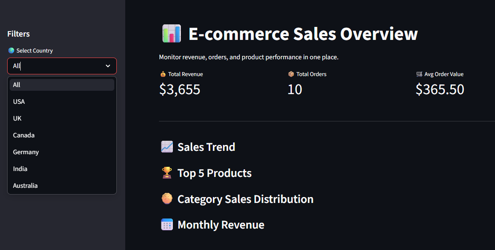

# E-commerce Sales Dashboard

This project analyzes e-commerce sales performance using Python.

## Features
- Revenue KPI
- Sales trend visualization
- Top products analysis
- Category revenue distribution

## Tools Used
- Python
- Streamlit
- Pandas
- Plotly

## How to Run

streamlit run app.py
## Dashboard Preview

